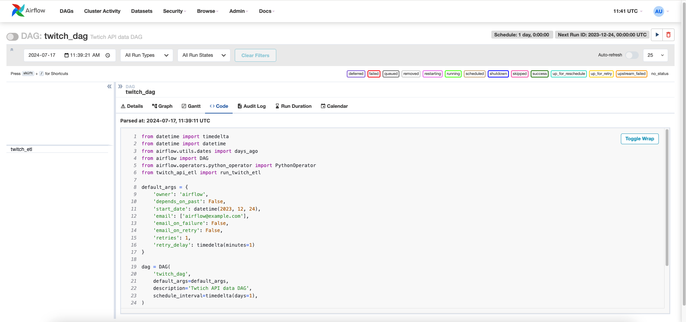
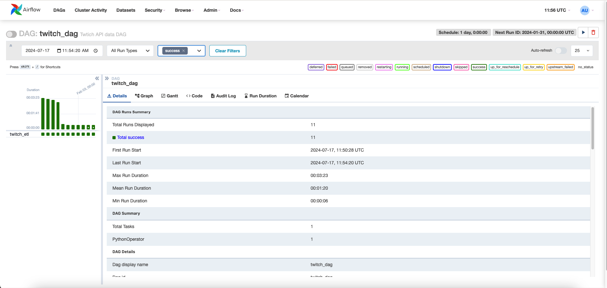
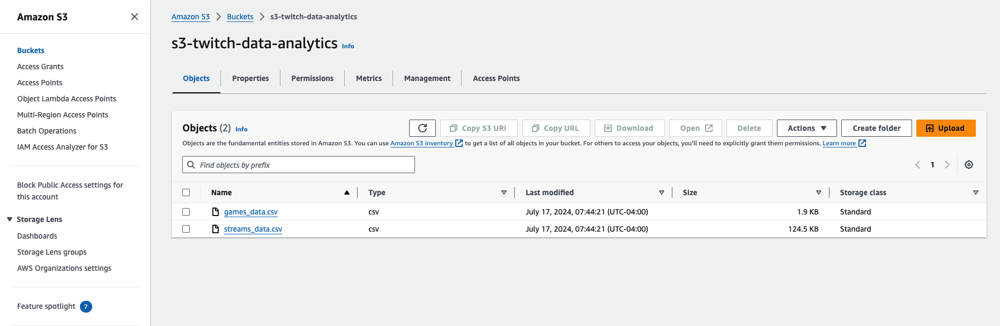

Project Report: Twitch Stream Data Analytics ETL Pipeline
=========================================================

1\. Introduction 🎯
-------------------

The objective of this project is to build an ETL (Extract, Transform, Load) pipeline to fetch stream data from the Twitch API, process the data, and store it in AWS S3 buckets. The pipeline leverages Apache Airflow on AWS EC2 Instance for workflow management and AWS IAM roles for secure communication between EC2 instances and S3 buckets. The end result is a comprehensive dataset that can be used for stream data analytics.

2\. Project Components 🔧
-------------------------

### 2.1. Twitch API Data Extraction 📡

-   **Script**: `twitch_api_etl.py`
-   **Functionality**: This Python script fetches stream data from the Twitch API in JSON format.
-   **Data Points**: Stream ID, user ID, game ID, viewer count, stream title, and timestamps.

**Skills Learned**:

-   API integration using Python
-   JSON data handling
-   Understanding Twitch API endpoints and Twitch App Registrations

### 2.2. Data Transformation 🔄

-   **Script**: `twitch_dag.py`
-   **Functionality**: A Custom Airflow DAG is used to manage the ETL workflow. The data fetched from the Twitch API is transformed from JSON format to a Pandas DataFrame. Necessary data cleaning and preprocessing steps are applied to ensure the data's quality.
-   **Output**: A cleaned and processed DataFrame ready for storage.

**Skills Learned**:

-   Workflow management with Apache Airflow
-   Schedule Jobs in Apache Airflow
-   Writing efficient data transformation scripts
  

### 2.3. Data Loading 📥

-   **Destination**: AWS S3 Buckets
-   **Storage Format**: CSV files
-   **Process**: The transformed DataFrame is converted into a CSV file and uploaded to AWS S3 buckets. IAM roles are configured to allow secure communication between the EC2 instance running the Airflow DAG and the S3 buckets.

**Skills Learned**:

-   Data storage in AWS S3
-   Configuring IAM roles for secure data transfer
-   Understanding AWS S3 permissions and policies

3\. Security 🔒
---------------

### 3.1. IAM Roles 🔑

Configured to ensure secure data transfer between EC2 instances and S3 buckets. The roles provide necessary permissions for data read/write operations.

**Skills Learned**:

-   Setting up IAM roles and policies in AWS
-   Managing access permissions for AWS services

4\. Scripts 💻
--------------

### 4.1. `twitch_api_etl.py`

Contains the logic to connect to the Twitch API, fetch stream data, and store it temporarily for transformation.

**Key Functions**:

-   `fetch_twitch_data()`: Connects to the Twitch API and retrieves stream data.
-   `save_to_temp()`: Saves the fetched data for further processing.

**Skills Learned**:

-   Writing Python scripts for API calls
-   Handling and storing API data

### 4.2. `twitch_dag.py`

An Apache Airflow DAG that defines the ETL workflow.

**Key Tasks**:

-   `extract()`: Invokes the data extraction script.
-   `transform()`: Converts JSON data to DataFrame and applies cleaning steps.
-   `load()`: Saves the transformed data to a CSV file and uploads it to S3.

**Skills Learned**:

-   Designing and implementing Airflow DAGs
-   Automating ETL processes
-   Integrating data extraction, transformation, and loading steps

5\. Data Files 📂
-----------------

### 5.1. Streams Data 🎥

-   **File**: `streams_data.csv`
-   **Contents**: Contains raw and processed stream data fetched from the Twitch API.

**Skills Learned**:

-   Structuring data for analytics

### 5.2. Games Data 🎮

-   **File**: `games_data.csv`
-   **Contents**: Contains data about Top 20 games streamed on Twitch, used for data enrichment and analytics.

**Skills Learned**:

-   Data enrichment techniques
-   Combining multiple datasets for comprehensive analysis

6\. Workflow 🛠️
----------------

### 6.1. Extraction 📤

Data is fetched from the Twitch API every 5 minutes using the `fetch_twitch_data()` function and saved temporarily for processing.

**Skills Learned**:

-   Scheduling regular data extraction
-   Handling API rate limits and scheduling

### 6.2. Transformation 🔄

The raw JSON data is converted to a Pandas DataFrame. Data cleaning steps include handling missing values, data type conversions, and filtering irrelevant data.

**Skills Learned**:

-   Data cleaning and preprocessing
-   Efficient data transformation techniques

### 6.3. Loading 📥

The cleaned data is saved as a CSV file and uploaded to an S3 bucket for storage and further analysis.

**Skills Learned**:

-   Data storage optimization
-   Secure and efficient data loading techniques

7\. Conclusion 🏁
-----------------

This ETL pipeline successfully automates the process of fetching, transforming, and storing Twitch stream data. By leveraging Apache Airflow, AWS S3, and secure IAM roles, the pipeline ensures efficient data processing and secure data transfer. The stored data can now be used for detailed stream data analytics to gain insights into Twitch streaming patterns, popular games, and viewer engagement.

**Skills Learned**:

-   End-to-end ETL pipeline development
-   Cloud services integration
-   Workflow automation

8\. Future Work 🚀
------------------

-   Integrate real-time analytics to provide live insights into Twitch stream data.
-   Implement data visualization dashboards using tools like Power BI or Tableau to present the insights.

